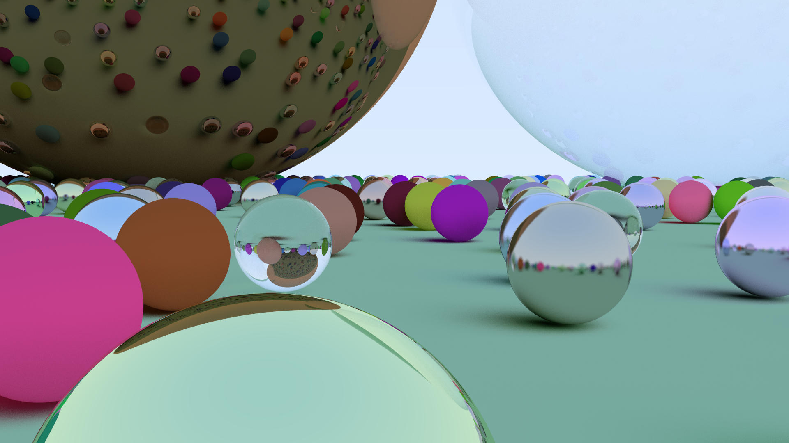

# Ray Tracer

**Yet another simple ray tracing implementation in Rust, based on Peter Shirley's ray tracing in one weekend book.**



## Installation
> rust must be installed.
```
git clone https://github.com/metinUr/ray-tracer.git
cd ray-tracer
cargo run --release
```

## Examples
### Diffuse Material


```
cargo run --release --example ex_lambertian
```

### Metal Material


```
cargo run --release --example ex_metal
```

### Glass Material


```
cargo run --release --example ex_dielectric
```

### Random Spheres


```
cargo run --release --example ex_random
```
or just run
```
cargo run --release
```
